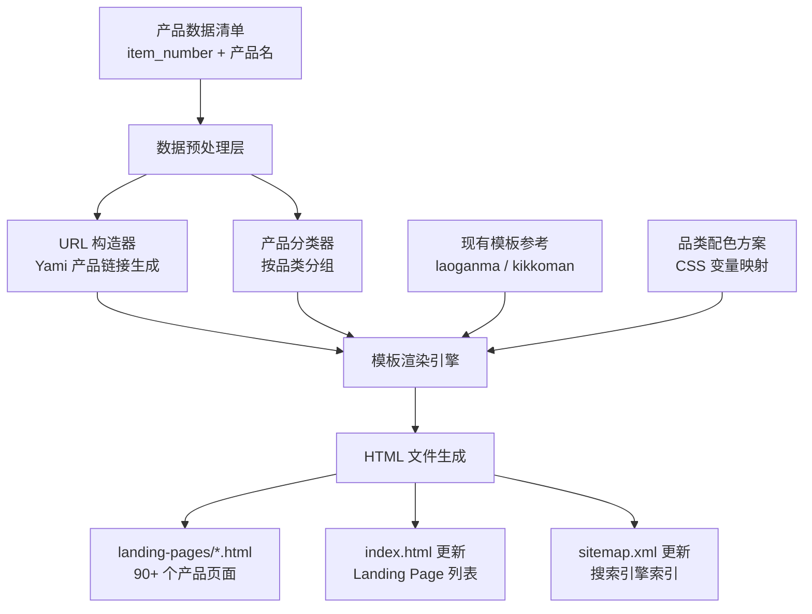
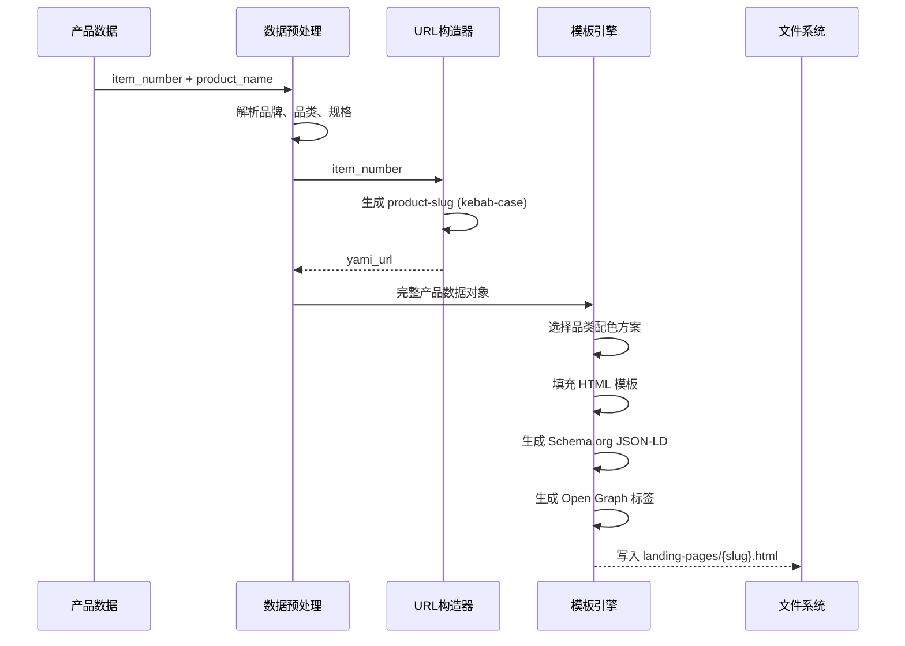
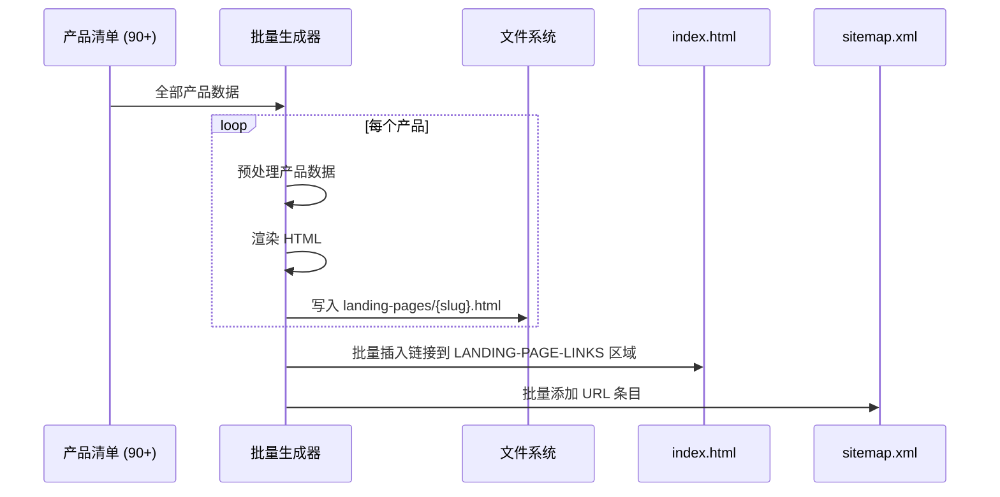

# 设计文档: 批量 SEO Landing Pages

## 概述

本功能为 zhouzk.com 静态博客站点批量创建约 90 个 SEO 优化的产品 Landing Page，覆盖 Yami.com 上的多品类商品（护肤、食品、饮料、家电、日用品等）。每个页面遵循现有 Landing Page 模板模式（纯 HTML + 内联 CSS/JS），包含完整的 Schema.org 结构化数据、Open Graph 标签和响应式设计。

产品购买链接通过 item_number 构造 Yami.com URL，格式为 `https://www.yami.com/en/p/{product-slug}/{item_number}`。所有页面需注册到 `index.html` 的 Landing Page 列表中，并更新 `sitemap.xml`。

本设计的核心挑战在于：如何在无构建系统的纯静态站点中，高效、一致地生成大量遵循统一模板的 HTML 文件，同时保证每个页面的 SEO 元素完整且内容差异化。

## 架构



## 时序图

### 单个 Landing Page 生成流程




### 批量生成与注册流程



## 组件与接口

### 组件 1: 产品数据模型

**职责**: 定义每个产品 Landing Page 所需的完整数据结构

```pascal
STRUCTURE ProductData
    item_number: String          // Yami 商品编号, 如 "1022541791"
    product_name: String         // 英文产品名称
    brand: String                // 品牌名, 从产品名解析
    category: CategoryEnum       // 品类分类
    slug: String                 // URL slug, kebab-case
    yami_url: String             // 完整 Yami 购买链接
    utm_url: String              // 带 utm_source 的追踪链接
    filename: String             // HTML 文件名
END STRUCTURE

ENUMERATION CategoryEnum
    SKINCARE        // 护肤品 (防晒、精华、面膜等)
    BEAUTY_DEVICE   // 美容仪器
    FOOD            // 食品 (零食、调味料、干货等)
    NOODLES         // 方便面/拉面
    BEVERAGE        // 饮料 (茶、果汁、碳酸饮料等)
    APPLIANCE       // 家电 (豆浆机、电饭煲、锅具等)
    HAIRCARE        // 洗护发
    HEALTH          // 健康用品 (牙膏、安全套等)
    SNACK           // 零食糕点
END ENUMERATION
```

### 组件 2: 品类配色方案

**职责**: 为不同品类产品提供差异化的视觉主题

```pascal
STRUCTURE ColorScheme
    primary: CSSColor           // 主色调
    primary_deep: CSSColor      // 深色变体 (hover 状态)
    primary_light: CSSColor     // 浅色背景
    accent: CSSColor            // 强调色
    cream: CSSColor             // Hero 区域渐变底色
END STRUCTURE
```

**品类配色映射**:

| 品类 | primary | primary_deep | primary_light | accent | 设计理念 |
|------|---------|-------------|---------------|--------|---------|
| SKINCARE | `#2E7D32` | `#1B5E20` | `#E8F5E9` | `#66BB6A` | 清新自然绿 |
| BEAUTY_DEVICE | `#7B1FA2` | `#4A148C` | `#F3E5F5` | `#CE93D8` | 科技紫 |
| FOOD | `#E65100` | `#BF360C` | `#FFF3E0` | `#FF9800` | 食欲暖橙 |
| NOODLES | `#D84315` | `#BF360C` | `#FBE9E7` | `#FF7043` | 热辣红橙 |
| BEVERAGE | `#0277BD` | `#01579B` | `#E1F5FE` | `#29B6F6` | 清爽蓝 |
| APPLIANCE | `#37474F` | `#263238` | `#ECEFF1` | `#78909C` | 科技灰 |
| HAIRCARE | `#AD1457` | `#880E4F` | `#FCE4EC` | `#F06292` | 柔美粉 |
| HEALTH | `#00695C` | `#004D40` | `#E0F2F1` | `#26A69A` | 健康青 |
| SNACK | `#F9A825` | `#F57F17` | `#FFFDE7` | `#FFEE58` | 活力黄 |

### 组件 3: URL 构造器

**职责**: 根据 item_number 生成 Yami 产品 URL

```pascal
PROCEDURE constructYamiUrl(item_number, product_name)
    INPUT: item_number (String), product_name (String)
    OUTPUT: yami_url (String), utm_url (String)
    
    SEQUENCE
        // 从产品名生成 URL slug
        slug ← generateSlug(product_name)
        
        // 构造基础 URL
        base_url ← "https://www.yami.com/en/p/" + slug + "/" + item_number
        
        // 添加 UTM 追踪参数
        utm_url ← base_url + "?utm_source=zhouzk.com"
        
        RETURN base_url, utm_url
    END SEQUENCE
END PROCEDURE
```

### 组件 4: HTML 模板结构

**职责**: 定义 Landing Page 的标准 HTML 结构

每个 Landing Page 遵循现有模板的固定 section 顺序:

1. `<head>` — Meta 标签 + Open Graph + Schema.org JSON-LD + 内联 CSS
2. `<nav>` — 固定导航栏 (glassmorphism 风格)
3. `<section class="hero">` — 产品主图 + 标题 + CTA
4. `<section class="section-dark">` — 痛点/为什么需要 (4 卡片网格)
5. `<section class="section-light">` — 使用场景 (4 卡片网格)
6. `<section>` — 数据/亮点 (4 统计数字)
7. `<section class="ingredients-section">` — 产品详情/成分 (4 卡片网格)
8. `<section>` — 氛围/体验 (4 色块网格)
9. `<section class="cta-section">` — 底部 CTA
10. `<footer>` — 版权声明
11. `<script>` — IntersectionObserver 淡入动画

## 数据模型

### 产品清单数据结构

```pascal
STRUCTURE ProductEntry
    item_number: String     // 如 "1022541791"
    product_name: String    // 如 "Matte Sun Stick with Mugwort+Camelia SPF50+ PA++++ 0.63 oz*2"
END STRUCTURE
```

**验证规则**:
- item_number 必须为非空数字字符串
- product_name 必须为非空英文字符串
- item_number 在清单中必须唯一

### 文件命名模型

```pascal
STRUCTURE FileNaming
    // 遵循 landing-pages/AGENTS.md 命名规范
    // 格式: {brand}-{product-name}-{variant}-{size}.html
    // 示例: biore-uv-aqua-rich-watery-essence-spf50-70g.html
    
    brand: String           // 小写品牌名
    product_key: String     // 产品关键词 (kebab-case)
    variant: String         // 可选: 规格/口味
    size: String            // 可选: 重量/容量
END STRUCTURE
```

### Yami URL 模型

```pascal
STRUCTURE YamiUrl
    // 基于现有页面观察到的 URL 模式:
    // https://www.yami.com/en/p/{product-slug}/{item_number}
    // 
    // 示例:
    // item_number: 1148123281
    // URL: https://www.yami.com/en/p/kikkoman-soy-sauce-hello-kitty-dispenser-5-fl-oz/1148123281
    //
    // item_number: 3147071831  
    // URL: https://www.yami.com/en/p/spicy-crispy-chili-oil-210g/3147071831
    
    base: "https://www.yami.com/en/p/"
    product_slug: String    // 从产品名生成的 kebab-case slug
    item_number: String     // 商品编号
    utm_source: "zhouzk.com"
END STRUCTURE
```


## 算法伪代码

### 主流程: 批量生成 Landing Pages

```pascal
ALGORITHM batchGenerateLandingPages(productList)
INPUT: productList — 产品条目数组 [{item_number, product_name}, ...]
OUTPUT: 生成的 HTML 文件列表, 更新后的 index.html 和 sitemap.xml

BEGIN
    ASSERT productList IS NOT EMPTY
    ASSERT ALL entries IN productList HAVE unique item_number
    
    generatedFiles ← EMPTY LIST
    indexLinks ← EMPTY LIST
    sitemapEntries ← EMPTY LIST
    
    // Step 1: 预处理所有产品数据
    FOR EACH entry IN productList DO
        productData ← preprocessProduct(entry)
        
        ASSERT productData.slug IS NOT EMPTY
        ASSERT productData.yami_url STARTS WITH "https://www.yami.com"
        
        // Step 2: 确定品类和配色
        category ← classifyProduct(productData.product_name)
        colorScheme ← getColorScheme(category)
        
        // Step 3: 生成文件名
        filename ← generateFilename(productData)
        
        ASSERT filename MATCHES PATTERN "{brand}-{name}*.html"
        ASSERT filename USES kebab-case
        
        // Step 4: 渲染 HTML
        html ← renderTemplate(productData, colorScheme)
        
        // Step 5: 写入文件
        WRITE html TO "landing-pages/" + filename
        
        generatedFiles.ADD(filename)
        indexLinks.ADD({href: filename, title: productData.product_name})
        sitemapEntries.ADD("https://zhouzk.com/landing-pages/" + filename)
    END FOR
    
    // Step 6: 更新 index.html
    updateIndexHtml(indexLinks)
    
    // Step 7: 更新 sitemap.xml
    updateSitemap(sitemapEntries)
    
    ASSERT LENGTH(generatedFiles) = LENGTH(productList)
    
    RETURN generatedFiles
END
```

**前置条件:**
- productList 包含有效的 item_number 和 product_name
- landing-pages/ 目录存在且可写
- 现有模板文件可作为参考

**后置条件:**
- 每个产品对应一个 HTML 文件在 landing-pages/ 目录下
- 所有 HTML 文件包含完整的 SEO 元素 (meta, OG, Schema.org)
- index.html 的 LANDING-PAGE-LINKS 区域包含所有新页面链接
- sitemap.xml 包含所有新页面 URL

**循环不变量:**
- generatedFiles 中的所有文件名唯一
- 已生成的所有 HTML 文件结构完整且有效

### 产品数据预处理算法

```pascal
ALGORITHM preprocessProduct(entry)
INPUT: entry {item_number, product_name}
OUTPUT: productData (完整的 ProductData 结构)

BEGIN
    // 提取品牌名 (通常是产品名的第一个词或已知品牌)
    brand ← extractBrand(entry.product_name)
    
    // 生成 URL slug
    slug ← entry.product_name
        |> LOWERCASE
        |> REPLACE special_chars WITH "-"
        |> REPLACE multiple_dashes WITH single_dash
        |> TRIM leading/trailing dashes
    
    // 构造 Yami URL
    yami_url ← "https://www.yami.com/en/p/" + slug + "/" + entry.item_number
    utm_url ← yami_url + "?utm_source=zhouzk.com"
    
    // 生成文件名 (遵循 AGENTS.md 命名规范)
    filename ← generateFilename(brand, entry.product_name)
    
    RETURN ProductData {
        item_number: entry.item_number,
        product_name: entry.product_name,
        brand: brand,
        category: classifyProduct(entry.product_name),
        slug: slug,
        yami_url: yami_url,
        utm_url: utm_url,
        filename: filename
    }
END
```

### 产品分类算法

```pascal
ALGORITHM classifyProduct(product_name)
INPUT: product_name (String)
OUTPUT: category (CategoryEnum)

BEGIN
    name ← UPPERCASE(product_name)
    
    // 护肤品关键词
    IF name CONTAINS ANY OF ["SUNSCREEN", "SUN STICK", "SUN CREAM", "SUN SERUM",
        "SPF", "PA++++", "SERUM", "AMPOULE", "CREAM", "FOUNDATION", "MASK",
        "SKINCARE", "CENTELLA", "ACNE", "SOFTENER", "PORE", "PERFUME",
        "TONE BRIGHTENING", "EYE SERUM"] THEN
        RETURN SKINCARE
    END IF
    
    // 美容仪器
    IF name CONTAINS ANY OF ["BEAUTY DEVICE", "AGE-R", "BOOSTER", "RF BEAUTY",
        "FACIAL TECH", "ZEUS"] THEN
        RETURN BEAUTY_DEVICE
    END IF
    
    // 洗护发
    IF name CONTAINS ANY OF ["SHAMPOO", "CONDITIONER", "HAIR MASK", "HAIR OIL",
        "TSUBAKI", "FINO", "PON PON POWDER"] THEN
        RETURN HAIRCARE
    END IF
    
    // 方便面/拉面
    IF name CONTAINS ANY OF ["RAMEN", "NOODLES", "BULDAK", "TONKOTSU"] THEN
        RETURN NOODLES
    END IF
    
    // 饮料
    IF name CONTAINS ANY OF ["TEA", "DRINK", "MILK", "SODA", "RAMUNE",
        "ORONAMIN", "FANTA", "MATCHA POWDER"] THEN
        RETURN BEVERAGE
    END IF
    
    // 家电
    IF name CONTAINS ANY OF ["RICE COOKER", "SOY MILK MAKER", "KETTLE",
        "SKILLET", "HOT POT", "DUTCH OVEN", "STERILIZER", "TATUNG",
        "ZOJIRUSHI", "JOYOUNG"] THEN
        RETURN APPLIANCE
    END IF
    
    // 健康用品
    IF name CONTAINS ANY OF ["TOOTHPASTE", "CONDOM"] THEN
        RETURN HEALTH
    END IF
    
    // 零食糕点
    IF name CONTAINS ANY OF ["CAKE", "PASTRY", "CHIPS", "CRACKERS", "CANDY",
        "GIFT BOX", "TARTS", "CHOCOLATE", "JELLY", "SWEET POTATO"] THEN
        RETURN SNACK
    END IF
    
    // 默认: 食品
    RETURN FOOD
END
```

### HTML 模板渲染算法

```pascal
ALGORITHM renderTemplate(productData, colorScheme)
INPUT: productData (ProductData), colorScheme (ColorScheme)
OUTPUT: html (String — 完整的 HTML 文档)

BEGIN
    html ← EMPTY STRING
    
    // 1. 渲染 <head> 区域
    html.APPEND renderHead(productData, colorScheme)
    // 包含: charset, viewport, title, meta description, keywords
    // 包含: Open Graph 标签 (og:type=product, og:url, og:title, og:description, og:image)
    // 包含: Schema.org JSON-LD (Product, Offer, Brand)
    // 包含: 内联 <style> (CSS 变量使用 colorScheme)
    
    // 2. 渲染 <body> 区域
    html.APPEND "<body>"
    
    // 2a. 导航栏
    html.APPEND renderNav(productData)
    // 固定导航: 品牌名 | 导航链接 | Buy Now CTA
    
    // 2b. Hero 区域
    html.APPEND renderHero(productData)
    // 产品主图 (Yami CDN) + 标题 + 副标题 + CTA 按钮
    
    // 2c. 痛点区域 (section-dark)
    html.APPEND renderPainPoints(productData)
    // 4 个痛点卡片, 基于产品品类生成
    
    // 2d. 使用场景 (section-light)
    html.APPEND renderScenes(productData)
    // 4 个场景卡片
    
    // 2e. 数据亮点
    html.APPEND renderStats(productData)
    // 4 个统计数字
    
    // 2f. 产品详情/成分
    html.APPEND renderDetails(productData)
    // 4 个详情卡片
    
    // 2g. 氛围/体验
    html.APPEND renderAtmosphere(productData, colorScheme)
    // 4 个色块卡片, 颜色基于 colorScheme
    
    // 2h. 底部 CTA
    html.APPEND renderCTA(productData)
    
    // 2i. Footer
    html.APPEND renderFooter(productData)
    
    // 2j. 淡入动画脚本
    html.APPEND renderFadeInScript()
    
    html.APPEND "</body></html>"
    
    RETURN html
END
```

### index.html 更新算法

```pascal
ALGORITHM updateIndexHtml(newLinks)
INPUT: newLinks — [{href, title}, ...] 新增的 Landing Page 链接
OUTPUT: 更新后的 index.html

BEGIN
    content ← READ FILE "index.html"
    
    // 找到插入标记位置
    startMarker ← "<!-- LANDING-PAGE-LINKS:START -->"
    endMarker ← "<!-- LANDING-PAGE-LINKS:END -->"
    
    ASSERT content CONTAINS startMarker
    ASSERT content CONTAINS endMarker
    
    // 保留现有链接
    existingLinks ← EXTRACT content BETWEEN startMarker AND endMarker
    
    // 生成新链接 HTML
    newLinksHtml ← EMPTY STRING
    FOR EACH link IN newLinks DO
        newLinksHtml.APPEND '<li><a href="./landing-pages/' + link.href + '">'
        newLinksHtml.APPEND link.title + '</a></li>'
    END FOR
    
    // 替换区域内容
    updatedContent ← REPLACE content 
        FROM startMarker TO endMarker 
        WITH startMarker + existingLinks + newLinksHtml + endMarker
    
    WRITE updatedContent TO "index.html"
END
```


## 关键函数与形式化规格

### 函数 1: generateSlug()

```pascal
PROCEDURE generateSlug(product_name)
    INPUT: product_name (String)
    OUTPUT: slug (String, kebab-case)
    
    SEQUENCE
        slug ← LOWERCASE(product_name)
        slug ← REPLACE ALL "[^a-z0-9\s-]" WITH "" IN slug
        slug ← REPLACE ALL "\s+" WITH "-" IN slug
        slug ← REPLACE ALL "-+" WITH "-" IN slug
        slug ← TRIM "-" FROM BOTH ENDS OF slug
        
        // 截断过长的 slug
        IF LENGTH(slug) > 80 THEN
            slug ← SUBSTRING(slug, 0, 80)
            slug ← TRIM "-" FROM END OF slug
        END IF
        
        RETURN slug
    END SEQUENCE
END PROCEDURE
```

**前置条件:**
- product_name 非空字符串

**后置条件:**
- 返回值仅包含 `[a-z0-9-]` 字符
- 返回值不以 `-` 开头或结尾
- 返回值长度 ≤ 80 字符

### 函数 2: generateFilename()

```pascal
PROCEDURE generateFilename(brand, product_name)
    INPUT: brand (String), product_name (String)
    OUTPUT: filename (String, 如 "biore-uv-aqua-rich-70g.html")
    
    SEQUENCE
        // 提取关键信息
        key_parts ← extractKeyParts(product_name)
        // key_parts 包含: 产品核心名称, 规格/容量 (如有)
        
        // 组合文件名
        name_slug ← generateSlug(brand + " " + key_parts.core_name)
        
        IF key_parts.size IS NOT EMPTY THEN
            name_slug ← name_slug + "-" + generateSlug(key_parts.size)
        END IF
        
        filename ← name_slug + ".html"
        
        RETURN filename
    END SEQUENCE
END PROCEDURE
```

**前置条件:**
- brand 和 product_name 均为非空字符串

**后置条件:**
- 返回值以 `.html` 结尾
- 返回值使用 kebab-case
- 返回值遵循 `{brand}-{product-name}*.html` 模式

### 函数 3: extractBrand()

```pascal
PROCEDURE extractBrand(product_name)
    INPUT: product_name (String)
    OUTPUT: brand (String)
    
    SEQUENCE
        // 已知品牌映射表
        KNOWN_BRANDS ← {
            "Biore", "PAIR", "NIVEA", "SKIN1004", "Anua", "COSRX",
            "FINO", "TSUBAKI", "Kikkoman", "Laoganma", "Samyang",
            "Zojirushi", "Tatung", "Joyoung", "Godiva", "Okamoto",
            "LION", "Ichiniran", "Dongwon", "Sulwhasoo", "Coleology",
            "Premio", "Oronamin", "Fanta"
        }
        
        FOR EACH brand IN KNOWN_BRANDS DO
            IF product_name STARTS WITH brand 
               OR product_name CONTAINS brand THEN
                RETURN brand
            END IF
        END FOR
        
        // 回退: 使用第一个词作为品牌
        RETURN FIRST_WORD(product_name)
    END SEQUENCE
END PROCEDURE
```

**前置条件:**
- product_name 非空

**后置条件:**
- 返回非空品牌名
- 如果产品名包含已知品牌, 返回该品牌

## 示例用法

### 示例 1: 单个产品数据预处理

```pascal
SEQUENCE
    entry ← {
        item_number: "1022541791",
        product_name: "Matte Sun Stick with Mugwort+Camelia SPF50+ PA++++ 0.63 oz*2【Value Pack】"
    }
    
    productData ← preprocessProduct(entry)
    // productData.brand = "Anua"  (需要品牌映射)
    // productData.category = SKINCARE  (包含 "Sun Stick", "SPF")
    // productData.slug = "matte-sun-stick-with-mugwort-camelia-spf50-pa-0-63-oz-2-value-pack"
    // productData.yami_url = "https://www.yami.com/en/p/matte-sun-stick.../1022541791"
    // productData.filename = "anua-matte-sun-stick-mugwort-camelia-spf50.html"
END SEQUENCE
```

### 示例 2: 生成的 HTML 结构 (简化)

```html
<!DOCTYPE html>
<html lang="en">
<head>
    <meta charset="UTF-8">
    <meta name="viewport" content="width=device-width, initial-scale=1.0">
    <title>Biore UV Aqua Rich Watery Essence SPF50+ 70g | Best Japanese Sunscreen</title>
    <meta name="description" content="Biore UV Aqua Rich Watery Essence SPF50+ PA++++ 70g...">
    <meta name="keywords" content="Biore sunscreen, UV Aqua Rich, SPF50, Japanese sunscreen, Yami">
    <meta property="og:type" content="product">
    <meta property="og:url" content="https://www.yami.com/en/p/biore-uv.../1023232331">
    <!-- ... 其他 OG 标签 ... -->
    <script type="application/ld+json">
    {
        "@context": "https://schema.org",
        "@type": "Product",
        "name": "Biore UV Aqua Rich Watery Essence SPF50+ PA++++ 70g",
        "brand": { "@type": "Brand", "name": "Biore" },
        "offers": {
            "@type": "Offer",
            "url": "https://www.yami.com/en/p/biore-uv.../1023232331",
            "priceCurrency": "USD",
            "availability": "https://schema.org/InStock"
        }
    }
    </script>
    <style>
        :root {
            --primary: #2E7D32;      /* SKINCARE 品类绿色 */
            --primary-deep: #1B5E20;
            --primary-light: #E8F5E9;
            --accent: #66BB6A;
            --cream: #F1F8E9;
            /* ... 其余 CSS 变量和样式与现有模板一致 ... */
        }
    </style>
</head>
<body>
    <!-- Nav / Hero / Pain / Scenes / Stats / Details / Atmosphere / CTA / Footer -->
    <!-- 结构与 laoganma / kikkoman 模板完全一致 -->
</body>
</html>
```

### 示例 3: index.html 链接注册

```html
<!-- LANDING-PAGE-LINKS:START -->
<!-- 现有链接保持不变 -->
<li><a href="./landing-pages/laoganma-spicy-crispy-chili-oil-210g">Laoganma Spicy Crispy Chili Oil 210g</a></li>
<!-- 新增链接 -->
<li><a href="./landing-pages/biore-uv-aqua-rich-watery-essence-spf50-70g">Biore UV Aqua Rich Watery Essence SPF50+ 70g</a></li>
<li><a href="./landing-pages/pair-acne-treatment-cream-24g">PAIR Acne Treatment Cream 24g</a></li>
<!-- ... 90+ 个新链接 ... -->
<!-- LANDING-PAGE-LINKS:END -->
```

## Correctness Properties

*A property is a characteristic or behavior that should hold true across all valid executions of a system—essentially, a formal statement about what the system should do. Properties serve as the bridge between human-readable specifications and machine-verifiable correctness guarantees.*

### Property 1: Slug 格式有效性

*For any* 非空产品名称字符串，generateSlug() 的输出应仅包含 `[a-z0-9-]` 字符，不以连字符开头或结尾，不包含连续连字符，长度不超过 80 个字符，且结果为非空字符串。

**Validates: Requirements 2.1, 2.2, 2.3, 2.4, 2.5, 2.6, 12.2**

### Property 2: 品类分类正确性

*For any* 产品名称，若其包含某品类的特定关键词，品类分类器应返回对应的品类；若不包含任何品类关键词，应默认返回 FOOD；且分类结果与产品名称的大小写无关（即 classify(name) == classify(UPPERCASE(name))）。

**Validates: Requirements 3.1, 3.2, 3.3, 3.4, 3.5, 3.6, 3.7, 3.8, 3.9, 3.10**

### Property 3: URL 格式与 UTM 参数正确性

*For any* 有效的产品数据，生成的基础 URL 应遵循 `https://www.yami.com/en/p/{slug}/{item_number}` 格式，UTM 链接应在基础 URL 后追加 `?utm_source=zhouzk.com` 参数。

**Validates: Requirements 4.1, 4.2, 4.3**

### Property 4: SEO 元标签完整性与一致性

*For any* 生成的 Landing Page，页面应包含含有产品名称的 `<title>` 标签、长度在 120-160 字符之间的 meta description、非空的 meta keywords，以及完整的 Open Graph 标签集合（og:type="product"、og:url、og:title、og:description、og:image），且 og:url 应指向有效的 Yami 产品链接。

**Validates: Requirements 7.1, 7.2, 7.3, 7.4, 7.5**

### Property 5: Schema.org JSON-LD 有效性

*For any* 生成的 Landing Page，其 JSON-LD 数据应可被 JSON.parse 正确解析，@type 为 "Product"，包含 name、brand、offers 字段，offers.url 与页面 og:url 值一致，且不包含具体价格数据。

**Validates: Requirements 8.1, 8.2, 8.3, 8.4, 8.5, 13.4**

### Property 6: HTML 结构完整性

*For any* 生成的 Landing Page，页面应包含全部 10 个标准 section（Nav、Hero、Pain Points、Scenes、Stats、Details、Atmosphere、CTA、Footer、FadeInScript），所有 CSS 以内联方式写入 `<style>` 标签，包含 IntersectionObserver 淡入动画脚本，HTML 标签使用 `lang="en"`，导航栏使用 glassmorphism 风格，CSS 中包含 768px 和 480px 响应式断点的 media query，以及 viewport meta 标签。

**Validates: Requirements 6.1, 6.2, 6.3, 6.4, 6.5, 11.1, 11.2**

### Property 7: 文件名有效性与唯一性

*For any* 生成的 Landing Page，文件名应遵循 `{brand}-{product-name}*.html` 模式，仅包含 `[a-z0-9-.]` 字符；且对于任意两个不同 item_number 的产品，生成的文件名应不同（冲突时追加 item_number 后 4 位区分）。

**Validates: Requirements 9.1, 9.2, 9.3, 10.1**

### Property 8: 批量生成注册完整性

*For any* 产品清单，批量生成后每个产品恰好对应一个 Landing Page 文件，且所有生成的页面在 index.html 的 LANDING-PAGE-LINKS 区域有对应链接，在 sitemap.xml 中有对应 URL 条目。

**Validates: Requirements 10.1, 10.2, 10.3**

### Property 9: 现有链接保留不变量

*For any* 批量生成操作，执行前 index.html 中 LANDING-PAGE-LINKS 区域的所有现有链接在执行后应完整保留，不被删除或修改。

**Validates: Requirement 10.4**

### Property 10: 输入验证与拒绝

*For any* 包含无效 item_number（空或非数字）的产品条目，预处理器应拒绝并返回错误信息；*For any* 包含重复 item_number 的产品清单，批量生成器应拒绝处理并报告重复条目。

**Validates: Requirements 1.4, 10.5**

### Property 11: ProductData 完整性与品牌提取

*For any* 有效的产品条目（item_number + product_name），预处理后的 ProductData 应包含全部 8 个字段且均非空；若产品名称包含已知品牌则提取该品牌，否则使用第一个词作为品牌名。

**Validates: Requirements 1.1, 1.2, 1.3**

### Property 12: 品类配色方案 CSS 变量一致性

*For any* 生成的 Landing Page，其 CSS `:root` 中的 `--primary` 变量值应与该产品品类在配色映射表中定义的 primary 颜色一致。

**Validates: Requirements 5.1, 5.2, 5.3**

### Property 13: 外部链接 HTTPS 协议

*For any* 生成的 Landing Page，页面中所有外部资源链接（字体、CDN、产品链接等）应使用 HTTPS 协议。

**Validates: Requirement 13.1**

## 错误处理

### 错误场景 1: 无法确定产品品牌

**条件**: 产品名称不包含已知品牌, 且首词不适合作为品牌名
**响应**: 使用 "Generic" 作为品牌名, 在文件名中省略品牌前缀
**恢复**: 生成后人工审核并修正品牌名

### 错误场景 2: 文件名冲突

**条件**: 两个不同产品生成了相同的文件名 (如同品牌同品类不同规格)
**响应**: 在文件名末尾追加 item_number 后 4 位作为区分
**恢复**: 自动处理, 无需人工干预

### 错误场景 3: 产品名称包含特殊字符

**条件**: 产品名包含 `【】*#` 等特殊字符 (如 "【Value Pack】", "SPF50+ PA++++")
**响应**: slug 生成时移除所有非字母数字字符, 保留语义
**恢复**: 自动处理

### 错误场景 4: Yami URL slug 不匹配

**条件**: 自动生成的 URL slug 与 Yami 实际 URL 不一致
**响应**: URL slug 需要通过实际访问 Yami 网站验证, 或使用 item_number 直接搜索
**恢复**: 提供备用 URL 格式 `https://www.yami.com/en/search?q={item_number}` 作为 fallback

### 错误场景 5: 品类分类错误

**条件**: 产品名称关键词匹配到错误品类 (如 "Matcha Powder" 可能是饮料也可能是烘焙)
**响应**: 优先匹配更具体的关键词, 模糊情况默认为 FOOD
**恢复**: 生成后人工审核品类分配

## 测试策略

### 单元测试方法

- 测试 `generateSlug()`: 验证特殊字符处理、长度截断、kebab-case 格式
- 测试 `classifyProduct()`: 验证所有 90+ 产品的品类分类正确性
- 测试 `extractBrand()`: 验证已知品牌提取和未知品牌回退逻辑
- 测试 `generateFilename()`: 验证命名规范合规性和唯一性
- 测试 `constructYamiUrl()`: 验证 URL 格式和 UTM 参数

### 基于属性的测试方法

**属性测试库**: 手动验证 (纯静态 HTML 项目, 无测试框架)

- **属性 1**: 对任意产品名输入, `generateSlug()` 输出仅包含 `[a-z0-9-]`
- **属性 2**: 对任意产品条目, 生成的 HTML 包含所有必需的 SEO 标签
- **属性 3**: 对任意两个不同 item_number, 生成的文件名不同
- **属性 4**: 对任意生成的页面, Schema.org JSON-LD 可被 JSON.parse 解析

### 集成测试方法

- 验证所有生成的 HTML 文件可在浏览器中正常加载 (无控制台错误)
- 验证 index.html 中所有新增链接可正常跳转
- 验证 sitemap.xml 格式有效
- 使用 Google Rich Results Test 验证 Schema.org 标记
- 响应式测试: 320px (手机), 768px (平板), 1024px+ (桌面)

## 性能考虑

- **文件大小**: 每个 Landing Page 约 15-20KB (内联 CSS), 与现有页面一致
- **图片加载**: 产品主图使用 Yami CDN (`cdn.yamibuy.net`), 设置 `fetchpriority="high"`
- **CSS 动画**: 使用 `IntersectionObserver` 实现懒加载淡入, 支持 `prefers-reduced-motion`
- **批量生成**: 90+ 个文件顺序生成, 无并发需求 (一次性操作)
- **Google Fonts**: 所有页面共享 Inter 字体, 浏览器缓存后无重复下载

## 安全考虑

- 所有外部链接使用 HTTPS
- UTM 参数不包含用户敏感信息
- Schema.org JSON-LD 中不包含价格信息 (避免过时数据误导)
- Footer 声明页面为营销演示用途, 产品详情来源于 Yami
- 不存储任何用户数据 (纯静态页面)

## 依赖

| 依赖 | 用途 | 来源 |
|------|------|------|
| Google Fonts (Inter) | 排版字体 | `fonts.googleapis.com` |
| Font Awesome | 图标 (如需要) | `cdnjs.cloudflare.com` |
| Yami CDN | 产品图片 | `cdn.yamibuy.net` |
| IntersectionObserver API | 淡入动画 | 浏览器原生 API |

无需任何 npm 包、构建工具或服务端依赖。所有内容为纯静态 HTML/CSS/JS。
