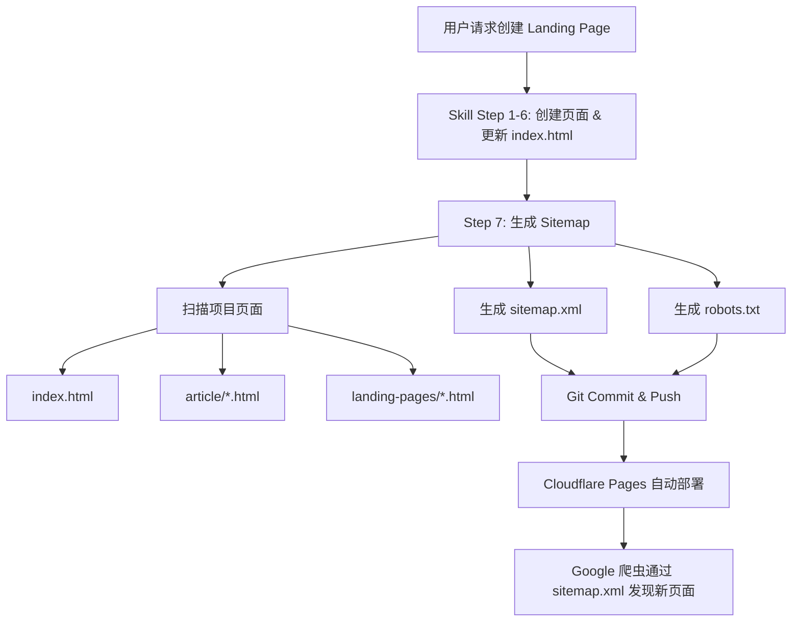
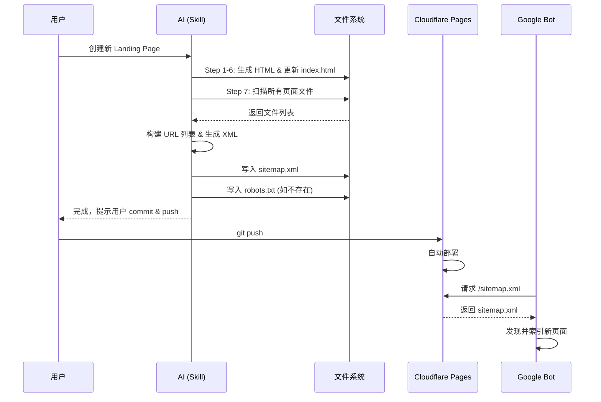

# 设计文档: Sitemap 自动生成

## 概述

本功能为现有的 SEO Landing Page Generator Skill 增加一个自动生成/更新 `sitemap.xml` 的步骤。当前每次创建新的 landing page 后，需要手动提交 URL 到 Google Search Console，效率低且容易遗漏。

通过在 Skill 工作流程的 Step 6（更新 `index.html`）之后新增一个 Step 7（生成 sitemap），AI 会自动扫描项目中所有活跃页面，生成符合 [Sitemaps 协议](https://www.sitemaps.org/protocol.html) 的 `sitemap.xml` 文件。配合 Cloudflare Pages 的自动部署，Google 爬虫可以通过 `https://zhouzk.com/sitemap.xml` 自动发现所有页面，无需手动提交。

同时生成 `robots.txt` 文件，声明 sitemap 位置，进一步提升搜索引擎的自动发现能力。

## 架构



## 流程图



## 组件与接口

### 组件 1: 页面扫描器 (Page Scanner)

**职责**: 扫描项目目录，收集所有需要纳入 sitemap 的页面路径。

**扫描规则**:
- 包含: `index.html`（根目录）
- 包含: `article/*.html`（所有文章页）
- 包含: `landing-pages/*.html`（所有 landing page）
- 排除: `landing-pages/backup/` 目录下的所有文件
- 排除: `landing-pages/test-*.html`（测试文件）
- 排除: `landing-pages/kikkoman-fixed.html`（修复中间文件）
- 排除: `public/` 目录（构建输出目录）


**接口**:

```pascal
PROCEDURE scanPages(projectRoot)
  INPUT: projectRoot (项目根目录路径)
  OUTPUT: pageList (PageInfo 列表)
  
  STRUCTURE PageInfo
    relativePath: String    -- 相对于项目根目录的文件路径
    url: String             -- 完整 URL (https://zhouzk.com/...)
    lastModified: Date      -- 文件最后修改时间
    priority: Decimal       -- 页面优先级 (0.0 - 1.0)
    changeFreq: String      -- 更新频率
  END STRUCTURE
END PROCEDURE
```

### 组件 2: Sitemap 生成器 (Sitemap Generator)

**职责**: 根据页面列表生成符合 Sitemaps 协议的 XML 文件。

**接口**:

```pascal
PROCEDURE generateSitemap(pageList)
  INPUT: pageList (PageInfo 列表)
  OUTPUT: sitemap.xml 文件内容 (String)
END PROCEDURE
```

### 组件 3: Robots.txt 生成器

**职责**: 生成或验证 `robots.txt` 文件，确保包含 sitemap 声明。

**接口**:

```pascal
PROCEDURE ensureRobotsTxt(projectRoot, sitemapUrl)
  INPUT: projectRoot (项目根目录路径), sitemapUrl (sitemap 完整 URL)
  OUTPUT: robots.txt 文件内容 (String)
END PROCEDURE
```

## 数据模型

### URL 映射规则

由于 Cloudflare Pages 支持 clean URLs（无 `.html` 后缀），URL 映射规则如下：

| 文件路径 | Sitemap URL | 优先级 | 更新频率 |
|---------|-------------|--------|---------|
| `index.html` | `https://zhouzk.com/` | 1.0 | weekly |
| `article/*.html` | `https://zhouzk.com/article/{name}` | 0.7 | monthly |
| `landing-pages/*.html` | `https://zhouzk.com/landing-pages/{name}` | 0.8 | monthly |

**注意**: URL 中不包含 `.html` 后缀，与 `index.html` 中的链接格式保持一致。

### sitemap.xml 输出格式

```xml
<?xml version="1.0" encoding="UTF-8"?>
<urlset xmlns="http://www.sitemaps.org/schemas/sitemap/0.9">
  <url>
    <loc>https://zhouzk.com/</loc>
    <lastmod>2026-02-23</lastmod>
    <changefreq>weekly</changefreq>
    <priority>1.0</priority>
  </url>
  <url>
    <loc>https://zhouzk.com/landing-pages/asian-market-online-yami</loc>
    <lastmod>2026-02-20</lastmod>
    <changefreq>monthly</changefreq>
    <priority>0.8</priority>
  </url>
  <!-- ... 更多页面 ... -->
</urlset>
```

### robots.txt 输出格式

```
User-agent: *
Allow: /

Sitemap: https://zhouzk.com/sitemap.xml
```

## 算法伪代码

### 主流程: 生成 Sitemap

```pascal
PROCEDURE generateSitemapStep(projectRoot)
  INPUT: projectRoot (项目根目录路径)
  OUTPUT: 生成 sitemap.xml 和 robots.txt 文件

  CONSTANT SITE_DOMAIN = "https://zhouzk.com"
  CONSTANT EXCLUDE_PATTERNS = ["backup/", "test-", "kikkoman-fixed"]

  SEQUENCE
    -- Step 1: 扫描所有页面
    pageList ← scanPages(projectRoot)

    -- Step 2: 生成 sitemap.xml
    xmlContent ← buildSitemapXml(pageList)
    WRITE xmlContent TO projectRoot + "/sitemap.xml"

    -- Step 3: 确保 robots.txt 存在
    ensureRobotsTxt(projectRoot, SITE_DOMAIN + "/sitemap.xml")

    -- Step 4: 验证
    VERIFY sitemap.xml 是合法 XML
    VERIFY 所有 URL 使用 HTTPS
    VERIFY 所有 URL 不包含 .html 后缀 (除根路径外)

    DISPLAY "sitemap.xml 已生成，包含 " + LENGTH(pageList) + " 个页面"
  END SEQUENCE
END PROCEDURE
```


### 页面扫描算法

```pascal
PROCEDURE scanPages(projectRoot)
  INPUT: projectRoot (项目根目录路径)
  OUTPUT: pageList (PageInfo 列表)

  SEQUENCE
    pageList ← EMPTY LIST

    -- 1. 添加首页
    IF FILE_EXISTS(projectRoot + "/index.html") THEN
      page ← NEW PageInfo
      page.relativePath ← "index.html"
      page.url ← "https://zhouzk.com/"
      page.lastModified ← GET_FILE_MODIFIED_DATE("index.html")
      page.priority ← 1.0
      page.changeFreq ← "weekly"
      ADD page TO pageList
    END IF

    -- 2. 扫描 article/ 目录
    FOR EACH file IN LIST_FILES(projectRoot + "/article/") DO
      IF file ENDS WITH ".html" THEN
        name ← REMOVE_EXTENSION(file)
        page ← NEW PageInfo
        page.relativePath ← "article/" + file
        page.url ← "https://zhouzk.com/article/" + name
        page.lastModified ← GET_FILE_MODIFIED_DATE("article/" + file)
        page.priority ← 0.7
        page.changeFreq ← "monthly"
        ADD page TO pageList
      END IF
    END FOR

    -- 3. 扫描 landing-pages/ 目录
    FOR EACH file IN LIST_FILES(projectRoot + "/landing-pages/") DO
      IF file ENDS WITH ".html"
         AND NOT file STARTS WITH "test-"
         AND NOT file CONTAINS "fixed"
         AND NOT PATH_CONTAINS(file, "backup/") THEN
        name ← REMOVE_EXTENSION(file)
        page ← NEW PageInfo
        page.relativePath ← "landing-pages/" + file
        page.url ← "https://zhouzk.com/landing-pages/" + name
        page.lastModified ← GET_FILE_MODIFIED_DATE("landing-pages/" + file)
        page.priority ← 0.8
        page.changeFreq ← "monthly"
        ADD page TO pageList
      END IF
    END FOR

    RETURN pageList
  END SEQUENCE
END PROCEDURE
```

**前置条件:**
- `projectRoot` 是有效的项目根目录
- 目录结构符合 AGENTS.md 中定义的规范

**后置条件:**
- 返回的 `pageList` 不包含 backup 目录、测试文件或中间文件
- 所有 URL 使用 `https://` 协议
- 所有 URL 不包含 `.html` 后缀（Cloudflare Pages clean URL）

**循环不变量:**
- 每次迭代后，`pageList` 中的所有条目都是有效的、非排除的页面

### Sitemap XML 构建算法

```pascal
PROCEDURE buildSitemapXml(pageList)
  INPUT: pageList (PageInfo 列表)
  OUTPUT: xmlContent (String)

  SEQUENCE
    xmlContent ← '<?xml version="1.0" encoding="UTF-8"?>' + NEWLINE
    xmlContent ← xmlContent + '<urlset xmlns="http://www.sitemaps.org/schemas/sitemap/0.9">' + NEWLINE

    -- 按优先级降序排列，同优先级按 URL 字母序
    SORT pageList BY priority DESC, url ASC

    FOR EACH page IN pageList DO
      xmlContent ← xmlContent + '  <url>' + NEWLINE
      xmlContent ← xmlContent + '    <loc>' + page.url + '</loc>' + NEWLINE
      xmlContent ← xmlContent + '    <lastmod>' + FORMAT_DATE(page.lastModified, "YYYY-MM-DD") + '</lastmod>' + NEWLINE
      xmlContent ← xmlContent + '    <changefreq>' + page.changeFreq + '</changefreq>' + NEWLINE
      xmlContent ← xmlContent + '    <priority>' + page.priority + '</priority>' + NEWLINE
      xmlContent ← xmlContent + '  </url>' + NEWLINE
    END FOR

    xmlContent ← xmlContent + '</urlset>' + NEWLINE

    RETURN xmlContent
  END SEQUENCE
END PROCEDURE
```

**前置条件:**
- `pageList` 非空
- 所有 `PageInfo` 条目的字段均已填充

**后置条件:**
- 输出是合法的 XML 文档
- 符合 Sitemaps 0.9 协议规范
- URL 按优先级降序排列

### Robots.txt 确保算法

```pascal
PROCEDURE ensureRobotsTxt(projectRoot, sitemapUrl)
  INPUT: projectRoot (项目根目录路径), sitemapUrl (sitemap 完整 URL)
  OUTPUT: 创建或更新 robots.txt

  SEQUENCE
    robotsPath ← projectRoot + "/robots.txt"

    IF FILE_EXISTS(robotsPath) THEN
      content ← READ_FILE(robotsPath)
      IF NOT content CONTAINS "Sitemap:" THEN
        content ← content + NEWLINE + "Sitemap: " + sitemapUrl + NEWLINE
        WRITE content TO robotsPath
      END IF
    ELSE
      content ← "User-agent: *" + NEWLINE
      content ← content + "Allow: /" + NEWLINE
      content ← content + NEWLINE
      content ← content + "Sitemap: " + sitemapUrl + NEWLINE
      WRITE content TO robotsPath
    END IF
  END SEQUENCE
END PROCEDURE
```

**前置条件:**
- `sitemapUrl` 是有效的 HTTPS URL

**后置条件:**
- `robots.txt` 文件存在于项目根目录
- 文件中包含 `Sitemap:` 声明指向正确的 URL

## 示例用法

### 场景: 创建新 Landing Page 后自动更新 Sitemap

```pascal
SEQUENCE
  -- 用户请求创建新的 landing page (Skill Step 1-6 已完成)
  -- 新文件: landing-pages/new-product.html
  -- index.html 已更新

  -- Step 7: 生成 Sitemap (新增步骤)
  generateSitemapStep("/project-root")

  -- 输出:
  -- sitemap.xml 已生成，包含 8 个页面:
  --   https://zhouzk.com/                                          (priority: 1.0)
  --   https://zhouzk.com/landing-pages/new-product                 (priority: 0.8)
  --   https://zhouzk.com/landing-pages/asian-market-online-yami    (priority: 0.8)
  --   https://zhouzk.com/landing-pages/chagee-boya-jasmine-tea     (priority: 0.8)
  --   ... (其他 landing pages)
  --   https://zhouzk.com/article/where-to-buy-asian-sunscreens-in-the-us (priority: 0.7)
  --
  -- robots.txt 已生成
END SEQUENCE
```


## Skill 工作流程变更

### 当前流程 (Step 1-7)

现有 SKILL.md 中的步骤保持不变，但原 Step 7 (Verify) 重新编号为 Step 9。新增步骤插入在 Step 6 之后：

| 步骤 | 内容 | 状态 |
|------|------|------|
| Step 1-6 | 原有流程（收集信息 → 生成页面 → 更新 index.html） | 不变 |
| **Step 7** | **生成/更新 sitemap.xml** | **新增** |
| **Step 8** | **确保 robots.txt 存在** | **新增** |
| Step 9 | 验证（原 Step 7，增加 sitemap 验证项） | 修改 |

### Step 7 详细说明: 生成 Sitemap

在更新 `index.html` 之后，AI 执行以下操作：

```pascal
PROCEDURE skillStep7_GenerateSitemap()
  SEQUENCE
    -- 1. 扫描项目中所有活跃页面
    pages ← scanPages(projectRoot)

    -- 2. 生成 sitemap.xml 内容
    xml ← buildSitemapXml(pages)

    -- 3. 写入 sitemap.xml 到项目根目录
    WRITE xml TO "sitemap.xml"

    -- 4. 输出确认信息
    DISPLAY "✅ sitemap.xml 已更新，共 " + LENGTH(pages) + " 个页面"
  END SEQUENCE
END PROCEDURE
```

### Step 8 详细说明: 确保 Robots.txt

```pascal
PROCEDURE skillStep8_EnsureRobotsTxt()
  SEQUENCE
    IF NOT FILE_EXISTS("robots.txt") THEN
      WRITE DEFAULT_ROBOTS_TXT TO "robots.txt"
      DISPLAY "✅ robots.txt 已创建"
    ELSE IF NOT FILE_CONTAINS("robots.txt", "Sitemap:") THEN
      APPEND "Sitemap: https://zhouzk.com/sitemap.xml" TO "robots.txt"
      DISPLAY "✅ robots.txt 已更新，添加 Sitemap 声明"
    ELSE
      DISPLAY "ℹ️ robots.txt 已存在且包含 Sitemap 声明，无需修改"
    END IF
  END SEQUENCE
END PROCEDURE
```

### Step 9 验证清单变更

在原有验证清单基础上，新增以下检查项：

```pascal
-- 新增 Sitemap 验证项
VERIFY FILE_EXISTS("sitemap.xml")
VERIFY sitemap.xml 是合法 XML (well-formed)
VERIFY sitemap.xml 包含刚创建的新页面 URL
VERIFY 所有 URL 使用 https:// 协议
VERIFY 所有 URL 不包含 .html 后缀
VERIFY FILE_EXISTS("robots.txt")
VERIFY robots.txt 包含 "Sitemap: https://zhouzk.com/sitemap.xml"
```

## 错误处理

### 场景 1: 文件系统读取失败

**条件**: 扫描目录时某个文件无法读取（权限问题或文件损坏）
**响应**: 跳过该文件，记录警告信息，继续处理其他文件
**恢复**: 在最终输出中列出被跳过的文件，提示用户检查

### 场景 2: sitemap.xml 写入失败

**条件**: 无法写入 sitemap.xml（磁盘空间不足或权限问题）
**响应**: 报告错误，不中断整个 Skill 流程（landing page 已生成成功）
**恢复**: 提示用户手动检查文件系统权限

### 场景 3: 无有效页面

**条件**: 扫描后 pageList 为空（极端情况）
**响应**: 不生成 sitemap.xml，显示警告信息
**恢复**: 提示用户检查项目目录结构是否正确

### 场景 4: 已存在的 sitemap.xml 格式异常

**条件**: 项目中已有 sitemap.xml 但不是由本流程生成的
**响应**: 完全覆盖重写（本流程每次都是全量生成，不做增量更新）
**恢复**: 无需恢复，全量生成保证一致性

## 测试策略

### 手动测试方法

由于本项目无构建系统和测试框架（符合 AGENTS.md 的 anti-pattern 约束），测试通过以下方式进行：

1. **XML 合法性验证**: 使用在线工具 [XML Validator](https://www.xmlvalidation.com/) 验证生成的 sitemap.xml
2. **Sitemap 协议验证**: 使用 [Google Search Console Sitemap 测试](https://search.google.com/search-console) 验证
3. **URL 可访问性**: 逐一检查 sitemap 中的 URL 是否可以正常访问
4. **Clean URL 验证**: 确认所有 URL 不包含 `.html` 后缀且能正确解析

### 验证清单

- [ ] `sitemap.xml` 存在于项目根目录
- [ ] XML 格式合法（well-formed）
- [ ] 包含所有活跃的 landing page URL
- [ ] 包含所有 article URL
- [ ] 包含首页 URL
- [ ] 不包含 backup 目录中的文件
- [ ] 不包含 test-*.html 文件
- [ ] 所有 URL 使用 `https://zhouzk.com` 域名
- [ ] 所有 URL 不包含 `.html` 后缀
- [ ] `lastmod` 日期格式为 `YYYY-MM-DD`
- [ ] `robots.txt` 存在于项目根目录
- [ ] `robots.txt` 包含正确的 `Sitemap:` 声明
- [ ] 部署后 `https://zhouzk.com/sitemap.xml` 可访问

## 性能考虑

- 当前站点页面数量少（<20 个），sitemap 生成为瞬时操作，无性能瓶颈
- Sitemap 文件大小极小（<5KB），不影响部署速度
- 每次全量重新生成（而非增量更新），逻辑简单且保证一致性，在当前规模下是最优方案
- 若未来页面数量超过 1000，可考虑 sitemap index 分片，但当前无需

## 安全考虑

- sitemap.xml 仅包含公开页面 URL，不涉及敏感信息
- 所有 URL 强制使用 HTTPS 协议
- robots.txt 使用 `Allow: /` 策略，与当前站点的公开性质一致
- 不在 sitemap 中暴露 backup 目录或测试文件的 URL

## 依赖

- **无新增外部依赖**: 本功能完全由 AI Skill 在工作流程中执行，不引入任何构建工具、npm 包或外部脚本
- **Sitemaps 协议 0.9**: XML 格式遵循 [sitemaps.org](https://www.sitemaps.org/protocol.html) 标准
- **Cloudflare Pages**: 依赖其 clean URL 功能（去除 `.html` 后缀）和自动部署能力
- **Google Search Console**: 可选，用于验证 sitemap 是否被正确抓取

## Correctness Properties

*A property is a characteristic or behavior that should hold true across all valid executions of a system-essentially, a formal statement about what the system should do. Properties serve as the bridge between human-readable specifications and machine-verifiable correctness guarantees.*

### Property 1: 排除文件不出现在扫描结果中

*For any* 项目目录结构，Page_Scanner 的输出列表中不应包含任何位于 `backup/` 目录下的文件、文件名以 `test-` 开头的文件、或 `kikkoman-fixed.html` 文件。

**Validates: Requirements 1.2, 1.3, 1.4**

### Property 2: URL 映射正确性

*For any* 被扫描到的 HTML 文件，其生成的 URL 应满足：使用 `https://` 协议前缀；`article/` 目录下的文件映射为 `https://zhouzk.com/article/{name}` 格式；`landing-pages/` 目录下的文件映射为 `https://zhouzk.com/landing-pages/{name}` 格式；除根路径外所有 URL 不包含 `.html` 后缀。

**Validates: Requirements 2.2, 2.3, 2.4, 2.5, 8.2, 8.3**

### Property 3: 目录决定元数据

*For any* 被扫描到的 HTML 文件，其 priority 和 changeFreq 值由所在目录唯一决定：`article/` 目录下的文件 priority 为 0.7、changeFreq 为 "monthly"；`landing-pages/` 目录下的文件 priority 为 0.8、changeFreq 为 "monthly"。

**Validates: Requirements 3.2, 3.3**

### Property 4: Sitemap XML 完整性（序列化 round-trip）

*For any* PageInfo 列表，Sitemap_Generator 生成的 XML 中应为每个 PageInfo 包含一个 `<url>` 元素，且该元素包含与输入一致的 `<loc>`、`<lastmod>`、`<changefreq>` 和 `<priority>` 值。即：解析生成的 XML 后提取的页面集合应与输入的 PageInfo 列表等价。

**Validates: Requirements 1.5, 4.3**

### Property 5: Sitemap XML 结构合法性

*For any* 非空 PageInfo 列表，Sitemap_Generator 生成的输出应是合法的 XML 文档（well-formed），包含 `<?xml version="1.0" encoding="UTF-8"?>` 声明，并使用 `http://www.sitemaps.org/schemas/sitemap/0.9` 作为 urlset 命名空间。

**Validates: Requirements 4.1, 4.2, 8.1**

### Property 6: Sitemap 排序规则

*For any* PageInfo 列表，Sitemap_Generator 生成的 XML 中 URL 条目应按 priority 降序排列，同 priority 的条目按 URL 字母升序排列。

**Validates: Requirements 4.5**

### Property 7: lastmod 日期格式

*For any* PageInfo 记录中的 lastModified 日期值，Sitemap_Generator 在 XML 中输出的 `<lastmod>` 值应符合 `YYYY-MM-DD` 格式。

**Validates: Requirements 4.4**

### Property 8: Robots.txt Sitemap 声明追加

*For any* 不包含 `Sitemap:` 声明的 robots.txt 文件内容，Robots_Generator 处理后的文件应包含 `Sitemap: https://zhouzk.com/sitemap.xml` 声明，且原有内容保持不变。

**Validates: Requirements 5.2, 8.4**

### Property 9: Robots.txt 幂等性

*For any* 已包含 `Sitemap:` 声明的 robots.txt 文件，Robots_Generator 处理后的文件内容应与处理前完全一致。

**Validates: Requirements 5.3**

### Property 10: Sitemap 生成确定性（覆盖无关性）

*For any* 项目目录结构，无论项目根目录中是否已存在 sitemap.xml 文件（或其内容如何），Sitemap_Generator 生成的 sitemap.xml 内容应仅由当前扫描到的活跃页面决定。

**Validates: Requirements 7.4**
